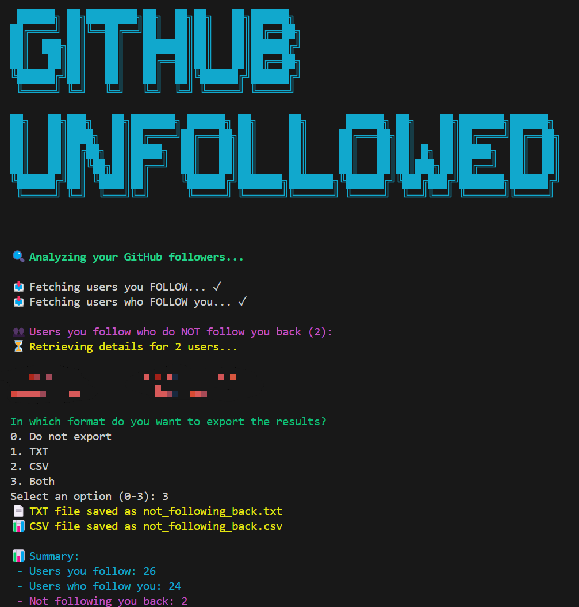

# 🐙 GitHub Follower Tracker

**GitHub Follower Tracker** is a simple yet powerful Python tool that lets you analyze your GitHub followers and identify which users you follow that don’t follow you back. With a clean interface, animated terminal spinners, optional export to TXT or CSV, and fast performance using parallel requests, it’s perfect for developers who want to keep their social graph tidy.

---

## 🚀 Features

- Detect users you follow who don’t follow you back
- Optional export to `.txt` and/or `.csv` files
- Parallel processing for faster execution
- Animated terminal feedback
- Colorized CLI using `colorama`

---

## 🖥️ How It Works

1. The script authenticates with your GitHub account using a **Personal Access Token**.
2. It fetches the list of users you follow and the users who follow you.
3. It compares both lists and detects users who don’t follow you back.
4. It fetches additional details (name, bio, followers, etc.) of those users.
5. It displays the results in the terminal and offers to export them to `.txt` and/or `.csv`.